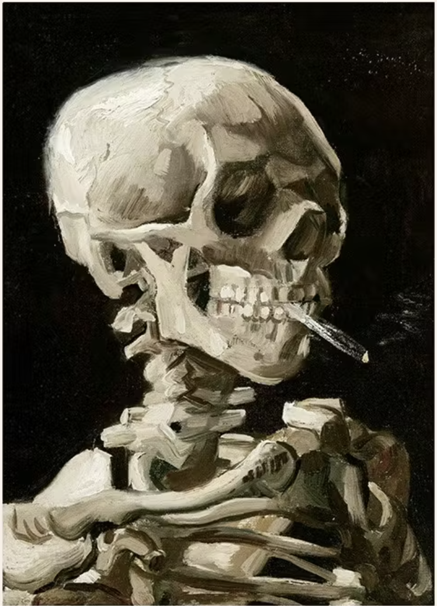
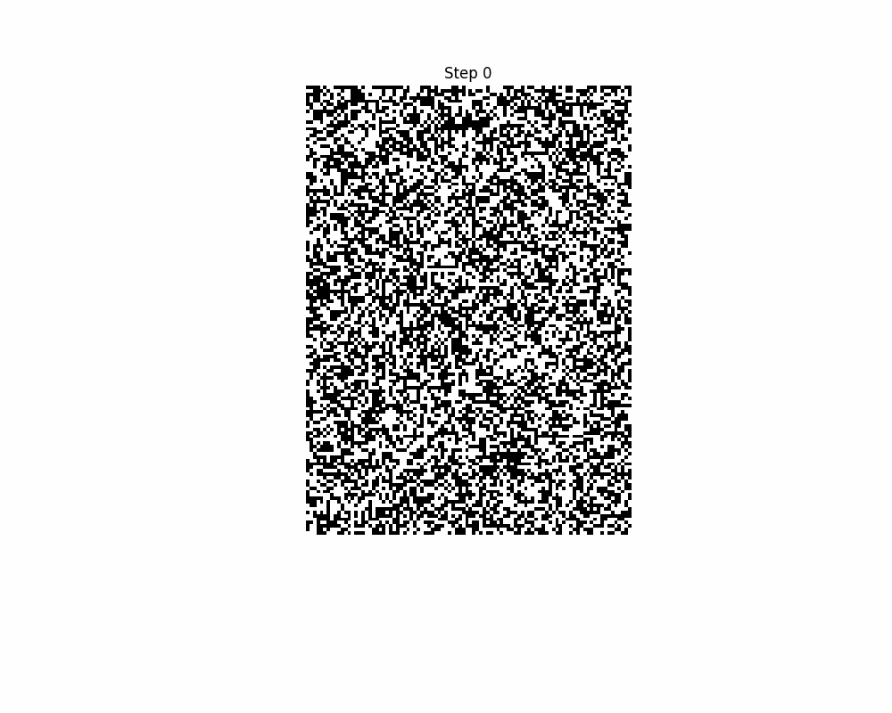

## ImagePhase - Ising Model Simulations with User-Uploaded Image-Based External Fields

This Flask app simulates the behavior of the Ising model over an external magnetic field of an uploaded image. The Ising model is the primary thermodynamic model used to understand phase transitions and describes the behavior of magnetic materials at a given temperature. In the Ising model, magnetic spins interact with their nearest neighbors and with an external magnetic field. Here, the external field is an image uploaded by the user. The result is an interesting visualization where the uploaded image seems to appear from the mist as the Ising model's spins align.

[Code Availability](https://github.com/DylanEsguerra/Ising_flask_app)

### How it works:

1. **Upload Image:**
   - Users can upload an image (in .png format) to the app.
   - The uploaded image is converted into a binary representation, where pixels above a certain threshold are considered as spin up and pixels below the threshold are considered as spin down.

2. **Simulation Parameters:**
   - Users can set various simulation parameters:
     - **Temperature:** Higher temperatures introduce more randomness to the system.
     - **Number of Steps:** The number of steps in the simulation.
     - **Downsample Factor:** Determines the size of the visualization. Increase this if the simulation is taking too long.
     - **Initial Spin Probability:** Probability of a pixel being initially spin up.
     - **External Field Weight:** Dictates how much force the external magnetic field exerts on the system.

3. **Start Simulation:**
   - After setting the parameters and uploading an image, users can start the simulation.
   - The app runs the Ising model simulation and generates an animated GIF that visualizes the evolution of the spin configuration over time.

4. **Simulation Visualization:**
   - The animated GIF is displayed to the user, showing the changing spin configuration over the course of the simulation.

### Files and Folders:
- `flask_app.py`: Contains the Flask application code.
- `static/`: Folder for storing the animation.
- `templates/`: Folder for storing HTML templates.
- `uploads/`: Folder for temporarily storing uploaded images.
- `requirements.txt`: Contains a list of required Python packages for running the app.
- `.gitignore`: Specifies files and folders to be ignored by Git.


### Usage Instructions:

1. **Clone the Repository:**
  
   
2. **Install Required Packages:**
   ```bash
   pip install -r requirements.txt
   ```

3. **Run the Flask App:**
   ```bash
   python flask_app.py
   ```

4. **Open the Local Server:**
   - Once the app is running, open a web browser and go to `http://127.0.0.1:5000` or `http://localhost:5000`.
   - Follow the instructions on the web page to upload an image and start the simulation.

### Example Uploaded Image and Resulting GIF:

- Uploaded Image: 

- Resulting GIF: 

### Authors:
- Dylan Esguerra

## References

Halim, Siana. “MODIFIED ISING MODEL for GENERATING BINARY IMAGES.” Jurnal Informatika, vol. 8, no. 2, 2007, pp. 115–118, ojs.petra.ac.id/ojsnew/index.php/inf/article/view/16776, https://doi.org/10.9744/informatika.8.2.pp. Accessed 12 May 2024.

Luke Polson. “Youtube_channel/Python Metaphysics Series/Vid14.Ipynb at Main · Lukepolson/Youtube_channel.” GitHub, 2023, github.com/lukepolson/youtube_channel/blob/main/Python%20Metaphysics%20Series/vid14.ipynb.

Meurice, Yannick. “Making Digital Aquatint with the Ising Model.” American Journal of Physics, vol. 90, no. 2, Feb. 2022, pp. 87–92, https://doi.org/10.1119/10.0006525. Accessed 8 June 2022.
